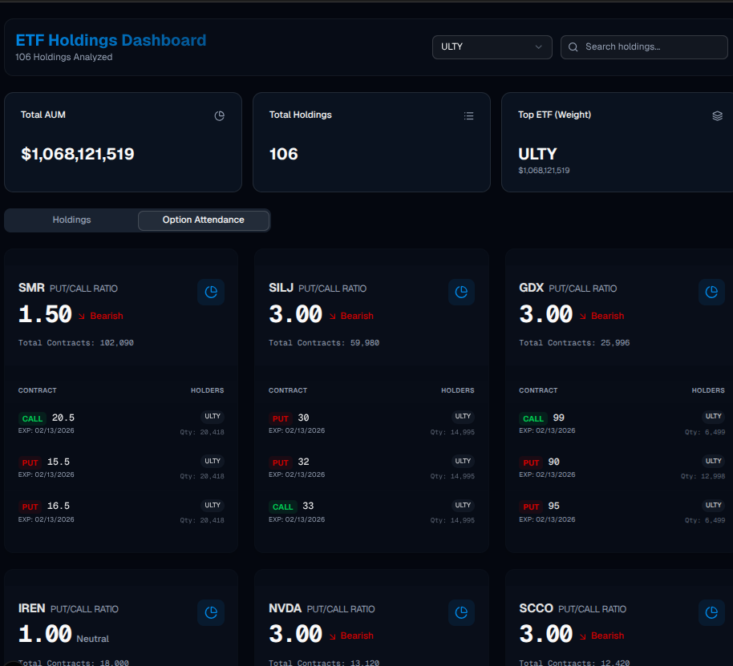

# ETF Holdings & Options Dashboard

A high-performance system for scraping, normalizing, and visualizing ETF holdings and options data. Designed for speed, utility, and a premium "Trader" aesthetic.



## 🚀 Standalone Scraper (`scrape_avantis.py`)

The core of this project is a robust Python engine designed to handle multiple fund sources and normalize them into a single, clean dataset. **You can use this engine independently of the UI.**

### Features
- **Multi-Source Support**: Scrapes Avantis (HTML/JSON), Kurv (CSV), YieldMax (CSV), and Rex Shares (POST/CSV).
- **Data Normalization**: Standardizes disparate column names (e.g., `shareQuantity`, `shares`, `Quantity`) into a unified schema.
- **Option Extraction**: Automatically parses complex name strings (e.g., `AAPL 250221P00150000`) to extract underlying, strike, expiry, and type.
- **Clean Output**: Generates `normalized_holdings.csv` with a consistent 15-column format.

### How to use the Scraper
1. **Install Dependencies**:
   ```bash
   pip install pandas requests beautifulsoup4
   ```
2. **Configure Funds**:
   Edit the `FUNDS` list at the top of `scrape_avantis.py` to add or remove ETFs.
3. **Run**:
   ```bash
   python3 scrape_avantis.py
   ```
   This will update `normalized_holdings.csv` in the current directory.

---

## 📊 Next.js Dashboard (`etf-dashboard`)

A sleek, dark-themed UI built with Next.js 14, Tailwind CSS, and Shadcn/UI to visualize the holdings.

### Key Features
- **TraderDaddy Theme**: Deep navy high-contrast design matching professional trading terminals.
- **Option Attendance Sheet**: A unique roaster-style view grouped by underlying stock. Shows the concentration of options across multiple ETFs.
- **Holdings Metrics**: High-performance sortable table with automatic "Short" position highlighting.
- **KPI Engine**: Real-time calculation of total AUM, P/C Ratios, and Sentiment.

### Running the Dashboard
1. **Setup**:
   ```bash
   cd etf-dashboard
   npm install
   ```
2. **Sync Data**:
   Ensure the latest `normalized_holdings.csv` is in `etf-dashboard/public/`.
3. **Run Dev**:
   ```bash
   npm run dev
   ```
   Access at [http://localhost:3000](http://localhost:3000)

## 🛠 Project Structure
- `scrape_avantis.py`: Standalone data engine.
- `etf-dashboard/`: Next.js web application.
- `normalized_holdings.csv`: Shared dataset (Source of truth).
- `screenshots/`: Project gallery.

---
*Created with focus on performance and modularity.*
